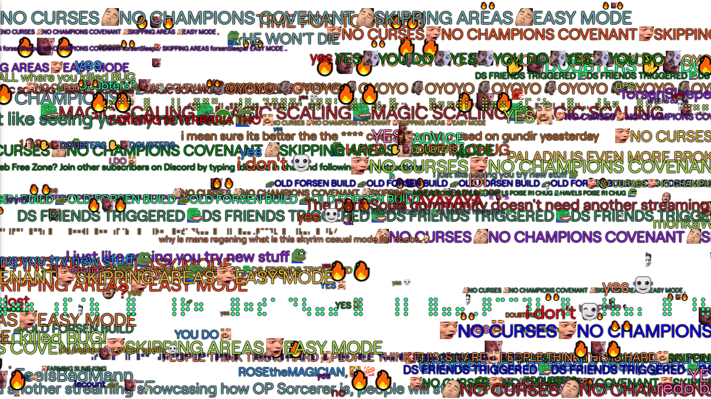

# Perplex Chat
## Remake of Wild Chat

### What it does

  
   A normal Twitch chat.

### How to try it out
Browse to https://alremahy.com/perplex-chat.html?channel=harmfulopinions, and watch the magic happen.
By changing the `?channel=<channel_name_goes_here>` part of the url, you connect to the specified streamer's chat.

### What it uses
  * [dank-twitch-irc](https://github.com/robotty/dank-twitch-irc) for retrieving Twitch messages.
  * [uHTML](https://github.com/WebReflection/uhtml) for rendering HTML templates.
  * [Sfc32](https://github.com/michaeldzjap/rand-seed/blob/develop/src/Algorithms/Sfc32.ts) for PRNG.
  * [xmur3](https://github.com/bryc/code/blob/master/jshash/PRNGs.md#addendum-a-seed-generating-functions) for seeding the PRNG.
  * [node-sass](https://github.com/sass/node-sass) for stylesheet management.
  * [Parcel 2](https://github.com/parcel-bundler/parcel/) for packing the files for use in the browser.

### How to build it yourself
  1. Make sure you have NodeJS (Latest LTS works).
  2. `npm i` to install modules.
  3. `npm build` to build it.
  4. You can now host the contents of the `/dist` folder wherever you'd like.
  * For testing purposes you can try it out locally with python3:
    * `npm run python3-http-server`

### Ideas for the future
  * Settings modal:
    * Background color.
    * Font changer (?).
    * Enable / Disable emotes (Twitch, BTTV, FFZ).
    * Change font sizes.
    * Enable / Disable AutoMod filter (IDENTITY, AGGRESSIVE, SEXUAL, PROFANITY).

Thanks to Twitch users `@idmgroup` & `@miaam` for the inspiration & the original Wild Chat software for the idea.
